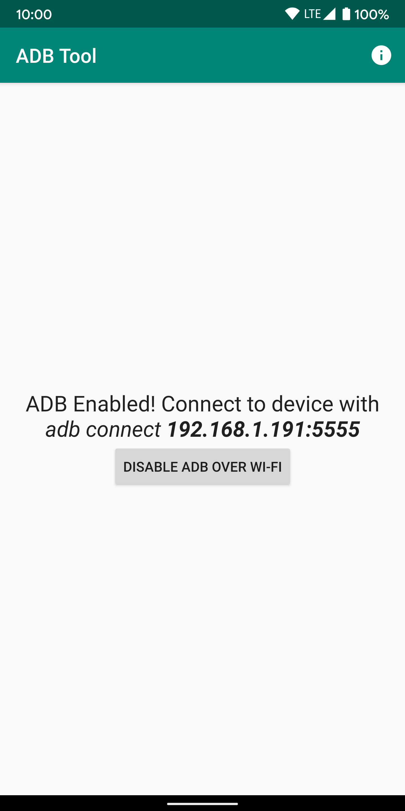
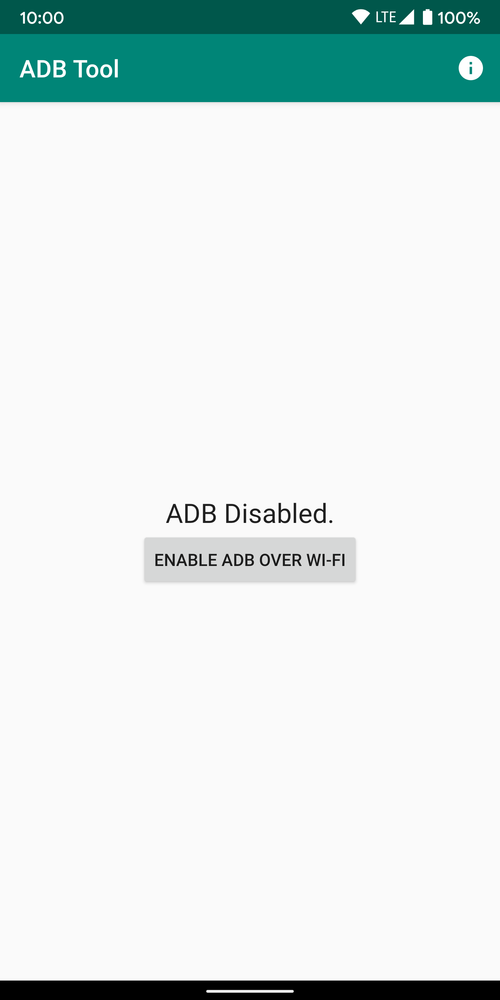
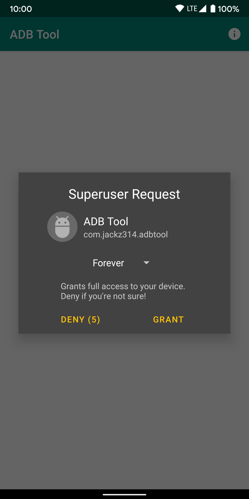

# adb-tool
ADB Tool to enable ADB over Wi-Fi easily. (Root required)

Now available on [Google Play](https://play.google.com/store/apps/details?id=com.jackz314.adbtool)[1](#googlelegalfoot).

## Overview
Simple tool to enable ADB over wifi without the need to connect via USB first.

## Requirements
Needs [root](https://en.wikipedia.org/wiki/Rooting_(Android)) privilages on the target device.

## Inspiration
I was sick of connecting my phone to my PC and typing `adb tcpip 5555` all the time.

## Future/To-Do
- [ ] automatically enable based on which WiFi the device is connected to.
- [ ] PC client for fully automated experience (no need for `adb connect`, the PC client would communicates and connects with target device automatically).
- [ ] other adb features (starting apps, screen streaming, file transfer interface...)

## Screenshots
  

## License
[MIT](https://choosealicense.com/licenses/mit/)

<a name="googlelegalfoot">1</a>
Google Play and the Google Play logo are trademarks of Google LLC.
